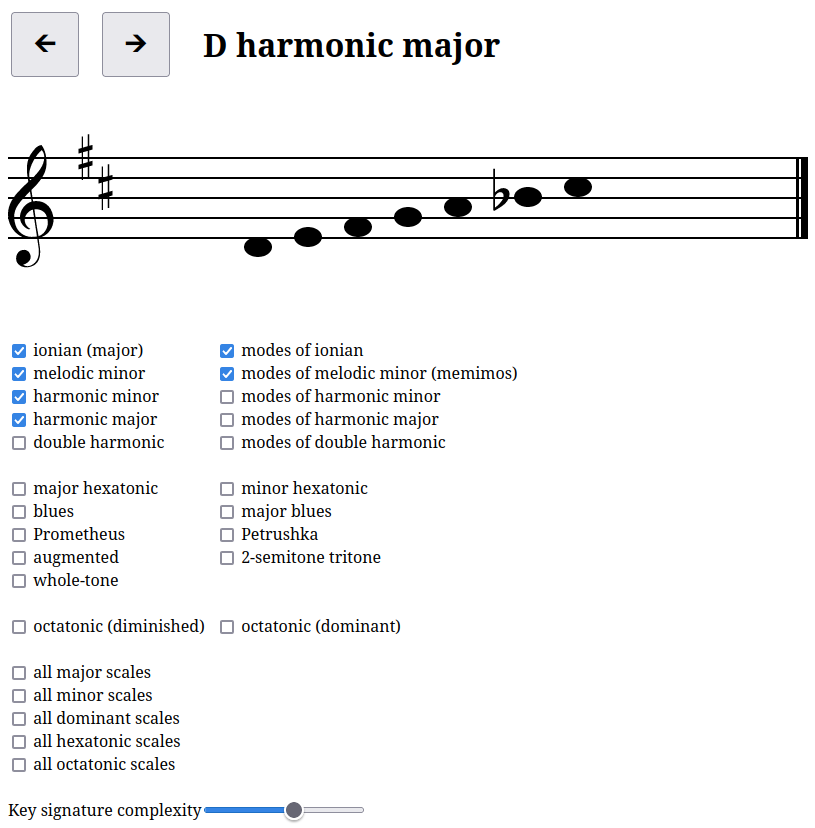

# dragon scalies

HAVE FUM PLAY SCALES 🎵

## screenshot



## build dependencies

- [tsc](https://www.typescriptlang.org/)
- [make](https://www.gnu.org/software/make/)

## run dependencies

a browser ;D

## how to build

```sh
make
```

## how to deploy

well if you're me then just run

```
make deploy
```

otherwise you are on your own!

## how to use

- open `index.html` in your broswer
- sit at piano
- play scales! make beautiful musics!

## how to test

Testing is still semi-manual; run:

```sh
make test
```

Then check the console in the automagically opened browser window for any test failures.

## TO DO

- label difficulty dial prettier
- implement rhythms scale types
- implement contrary motions scale types
- enharmonic scales
- scales with a non-7 number of tones
- add fingerings
- full on dan mode
- add choice of clefs
- add bass clef: for both hands
- the way a scale is chosen is naive:
    get one at random, 
    check whether it matches the criteria,
    try again until we get lucky.
    there are easier ways!
- cute fact bubble
    "the dorian scale is common in popular music, used by Thriller, Get Lucky, and Royals"
